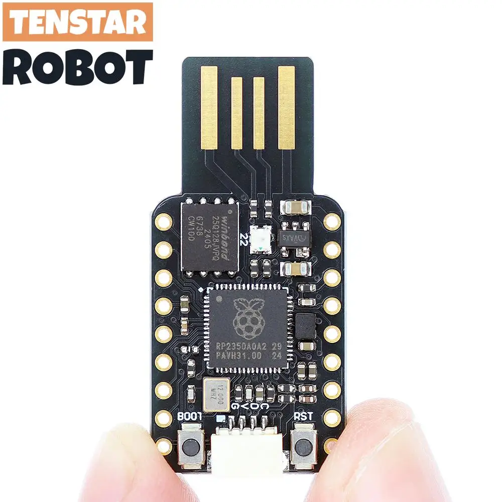

# pico-ducky (Refactored)

<div align="center">
  <strong>Cheap but powerful USB Rubber Ducky with Raspberry Pi Pico and WS2812 RGB LED support</strong>
</div>

<br />

<div align="center">
  
  
  
</div>

<br />

<div align="center">
  
</div>

---

## Quick Start Guide

1. Download the latest CircuitPython `.uf2` for your board:
   - [Raspberry Pi Pico](https://circuitpython.org/board/raspberry_pi_pico/)
   - [Raspberry Pi Pico 2](https://circuitpython.org/board/raspberry_pi_pico2/)

2. Put the board into bootloader mode by holding the **BOOTSEL** button while plugging it in. It will appear as a USB drive `RPI-RP2`.

3. Copy the `.uf2` file to the root of the Pico. It will reboot and reconnect as `CIRCUITPY`.

4. Copy the `lib` folder from the CircuitPython bundle to `CIRCUITPY`.

5. Copy the following files to the root of `CIRCUITPY`:

6. Also download `neopixel.mpy` [here](https://github.com/adafruit/Adafruit_CircuitPython_NeoPixel/releases).

boot.py
duckyinpython.py
code.py
pins.py


6. Copy your payload as `payload.dd` to the root of `CIRCUITPY`.

7. Connect the appropriate jumper for **setup mode** (GP0 to GND) to prevent auto-injection while editing payloads.

8. Enjoy your Pico-Ducky with RGB LED support!

---

## LED WS2812 RGB Support

- **LED_COLOR <name>** – Set LED to a predefined color (`RED`, `GREEN`, `BLUE`, `WHITE`, `YELLOW`, `CYAN`, `MAGENTA`, `ORANGE`, `PURPLE`, ...).
- **LED_RGB <r> <g> <b> [intensity]** – Set LED to custom RGB values (0–255 each), optionally scaled by intensity.
- **LED_OFF** – Turn off the LED and restore previous color if needed.

### Example DuckyScript

LED_NO_DEINIT_ON_EXIT
LED_COLOR RED
DELAY 500
LED_RGB 0 255 0 128

- Implicitly LED will shutdown until code reaches the end, if you want to avoid this you can add `LED_NO_DEINIT_ON_EXIT`.

---

## Payload Selection Pins

Multiple payloads supported. Ground one of these pins to select a payload:

| Pin  | Payload File |
|------|--------------|
| GP4  | payload.dd   |
| GP5  | payload2.dd  |
| GP10 | payload3.dd  |
| GP11 | payload4.dd  |

Default payload is `payload.dd` if no pin is grounded.

---

## Keyboard Layouts

- Only wired USB HID supported. Wireless/Pico W network features are deprecated.
- To change keyboard layout:
  1. Copy your language files (`keyboard_layout_win_LANG.py`, `keycode_win_LANG.py`) to `lib/`.
  2. Update `duckyinpython.py` to import the correct layout:
     ```py
     from keyboard_layout_win_LANG import KeyboardLayout
     from keycode_win_LANG import Keycode
     ```

---

## Notes

- **No wireless support** – network functionality removed for simplicity and stability.
- Fully supports WS2812 onboard RGB LED with intensity control and animations.
- Payloads can trigger LED feedback during execution.
- Refactored codebase is modular: **HID input**, **LED control**, and **payload management** are separated for maintainability.
- Compatible with Raspberry Pi Pico and Pico 2 series boards running CircuitPython 10.x.

---

## Useful Links

- [CircuitPython Documentation](https://docs.circuitpython.org/en/latest/README.html)
- [USB Rubber Ducky DuckyScript](https://github.com/hak5darren/USB-Rubber-Ducky/wiki/Duckyscript)
- [NeoPixel / WS2812](https://learn.adafruit.com/circuitpython-neopixel)
